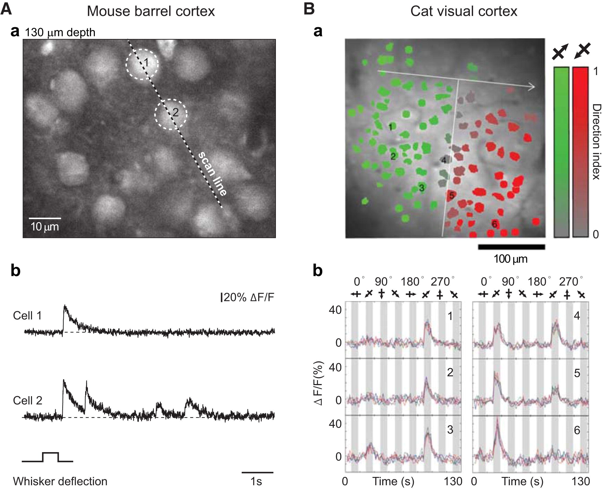

# Example analysis of calcium imaging data

## Calcium imaging experiments

Figure (7) taken from Grienberger and Konnerth (2012).

## Spontaneous activity
We will look at some data collected from developing retinal circuits;
in the absence of external (light) stimulation, the circuits are
spontaneously active.  Data from Sernagor et al. (2000).

## References

Grienberger C, Konnerth A (2012) Imaging calcium in neurons. Neuron
73:862–885 <http://dx.doi.org/10.1016/j.neuron.2012.02.011>

Sernagor E, Eglen SJ, O’Donovan MJ (2000) Differential effects of acetylcholine and glutamate blockade on the spatiotemporal dynamics of retinal waves. J Neurosci 20:RC56 <https://www.ncbi.nlm.nih.gov/pubmed/10632622>
